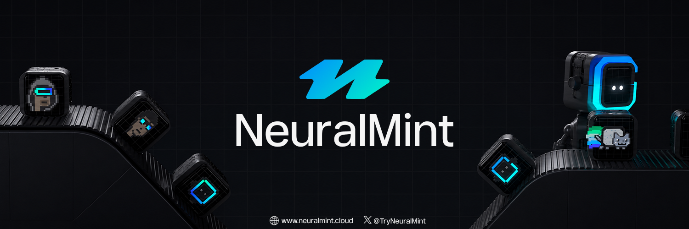

<div align="center">



<h1>NeuralMint Protocol</h1>

<p><strong>AI-generated NFT minting on Solana with a Token-2022 token-bound vault primitive.</strong><br/>
Every NFT custodies a deterministic, program-controlled vault holding 1,000,000 $NMINT. Trade the NFT, trade the vault.</p>

<p>
<a href="https://github.com/NeuralMint-dev/NeuralMintProtocol/actions/workflows/anchor.yml"></a>
<a href="https://github.com/NeuralMint-dev/NeuralMintProtocol/actions/workflows/ci.yml"></a>
<a href="https://github.com/NeuralMint-dev/NeuralMintProtocol/actions/workflows/security.yml"></a>


<a href="./LICENSE"></a>
</p>

<p>
<a href="https://x.com/TryNeuralMint"></a>
<a href="https://t.me/TryNeuralMint"></a>
<a href="https://neuralmint.cloud"></a>
</p>

</div>

---

## Overview

NeuralMint binds a fungible balance to a non-fungible token without storing an owner anywhere. A single PDA, derived solely from the NFT mint pubkey, owns a vault; the program is its only signer. Possession of the NFT is equivalent to control of the vault, so the unwrap rights move with the NFT on any marketplace.

- **One PDA derivation** — vault authority derived deterministically from the NFT mint.
- **Permissionless** — no admin keys; the program is the sole signer.
- **Portable** — list the NFT on Magic Eden or Tensor, the vault follows.
- **Token-2022 native** — works with SPL and Token-2022 mints.
- **Zero wrap fees** — wrap/unwrap operate at no protocol cost.
- **AI generation** — built-in prompt enhancer feeding a GPU pipeline (~8s latency).

## Project Structure

<pre>
NeuralMintProtocol/
├── <a href="programs/neuralmint">programs/neuralmint</a>/       Anchor program — initialize · wrap · unwrap
│   └── <a href="programs/neuralmint/src">src</a>/
│       ├── <a href="programs/neuralmint/src/instructions">instructions</a>/        Instruction handlers
│       ├── <a href="programs/neuralmint/src/state">state</a>/               Vault account layout
│       ├── <a href="programs/neuralmint/src/constants.rs">constants.rs</a>          Seeds and protocol constants
│       ├── <a href="programs/neuralmint/src/errors.rs">errors.rs</a>             Domain error codes
│       └── <a href="programs/neuralmint/src/lib.rs">lib.rs</a>                Program entrypoint
├── <a href="crates/nmint-core">crates/nmint-core</a>/         Runtime-agnostic PDA + vault math (Rust)
├── <a href="packages/sdk">packages/sdk</a>/              TypeScript SDK — @neuralmint/sdk
├── <a href="app">app</a>/                       Next.js 15 front end (GSAP · Lenis · wallet-adapter)
├── <a href="tests">tests</a>/                     Anchor integration tests
├── <a href="scripts">scripts</a>/                   Setup, build and validator tooling
├── <a href="docs">docs</a>/                      Architecture and API reference
├── <a href="examples">examples</a>/                  End-to-end SDK flows
└── <a href="Anchor.toml">Anchor.toml</a>               Anchor workspace configuration
</pre>

## Architecture

```
NFT Mint Address (on-chain)
    | PDA derivation
    v
Vault Authority (program-controlled, no private key)
    | controls
    v
Token Vault (1,000,000 $NMINT locked)
    | unwrap instruction (gated by NFT ownership)
    v
NFT Holder receives tokens
```

The two derivations that matter:

```
vault_authority = find_program_address(["vault-authority", nft_mint], program_id)
vault_state     = find_program_address(["vault-state",     nft_mint], program_id)
```

See [docs/architecture.md](docs/architecture.md) and [docs/token-bound-nft.md](docs/token-bound-nft.md) for the full design.

## Prerequisites

- Rust toolchain (stable)
- [Solana CLI](https://docs.solanalabs.com/cli/install) 1.18.17
- [Anchor](https://www.anchor-lang.com/docs/installation) 0.30.1
- Node.js >= 20 and Yarn

## Installation

```bash
git clone https://github.com/NeuralMint-dev/NeuralMintProtocol.git
cd NeuralMintProtocol
./scripts/setup.sh
```

### Build and Test

```bash
./scripts/build.sh        # build crates + program, sync IDL into the SDK
anchor test               # run the integration suite
cargo test -p nmint-core  # run the core unit tests
```

## SDK Usage

```bash
yarn add @neuralmint/sdk @solana/web3.js @solana/spl-token
```

```typescript
import { Connection } from '@solana/web3.js';
import { NeuralMintClient } from '@neuralmint/sdk';

const client = new NeuralMintClient({
  connection: new Connection('https://api.devnet.solana.com'),
});

// Initialize and fund a vault behind an NFT mint
const params = { nftMint, tokenMint, owner: wallet.publicKey };
await wallet.sendTransaction(client.initializeVaultTx(params), connection);
await wallet.sendTransaction(await client.wrapTx(params), connection);

// Inspect the vault
const vault = await client.fetchVault(nftMint);
console.log(vault.lockedAmount.toString());
```

Full API in [docs/api-reference.md](docs/api-reference.md); runnable flows in [examples/](examples).

## Program Instructions

| Instruction | Signer | Description |
|-------------|--------|-------------|
| `initialize` | payer | Creates the vault state and program-owned token account |
| `wrap` | depositor | Locks 1,000,000 $NMINT into the vault |
| `unwrap` | NFT holder | Releases the balance, gated by NFT ownership |

## Configuration

The front end reads its cluster and RPC endpoint from the environment:

```bash
NEXT_PUBLIC_CLUSTER=devnet              # localnet | devnet | mainnet-beta
NEXT_PUBLIC_RPC_ENDPOINT=https://...    # optional dedicated RPC override
```

## Technical Stack

- **Blockchain**: Solana, Token-2022, Metaplex
- **Program**: Rust, Anchor 0.30
- **SDK**: TypeScript, @solana/web3.js, @solana/spl-token
- **Front end**: Next.js 15, React 19, GSAP, Lenis, wallet-adapter
- **Marketplaces**: Magic Eden, Tensor compatible

## Security

The vault authority has no external private key; funds move only through `wrap` and `unwrap`, and `unwrap` requires proof of NFT ownership. Report vulnerabilities via GitHub Security Advisories — see [SECURITY.md](SECURITY.md).

## Roadmap

- [x] Token-bound vault program (initialize, wrap, unwrap)
- [x] Standalone core crate with PDA + ledger math
- [x] TypeScript SDK and Next.js front end
- [ ] Compressed NFT support (Bubblegum)
- [ ] Multi-asset vaults
- [ ] On-chain royalty enforcement hooks

## Contributing

Contributions are welcome. Read [CONTRIBUTING.md](CONTRIBUTING.md) for the workflow, commit convention and quality gates.

## Community

- Twitter / X: [@TryNeuralMint](https://x.com/TryNeuralMint)
- Telegram: [t.me/TryNeuralMint](https://t.me/TryNeuralMint)
- Website: [neuralmint.cloud](https://neuralmint.cloud)

## License

Released under the MIT License. See [LICENSE](LICENSE).
